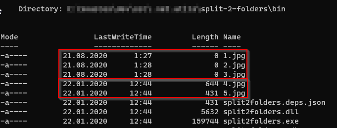
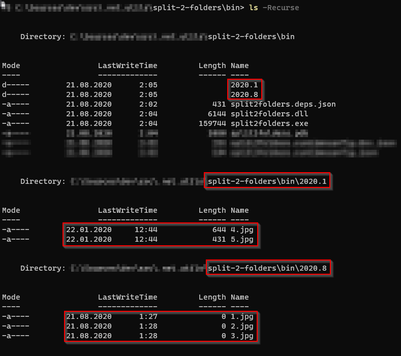

split-2-folders
===

[](https://www.nuget.org/packages/split2folders/)

[]()

Scans the current folder with the specified file mask and splits all the found files
by creation or modification date into separate folders like "yyyy.MM"

Get started
---

The tool is intended to be used as a global dotnet tool:

```shell
dotnet tool install -g split2folders
```

Then you can run it directly from the command line:

```shell
split2folders.exe [options] <mask>
```

Examples:
```shell
split2folders.exe *.*                   - splits by creation date
split2folders.exe -c *.*                - splits by creation date
split2folders.exe -f "yyyy MM dd" *.*   - splits by creation date with the specified format
split2folders.exe -m *.*                - splits by modification date
split2folders.exe -m -f "yyyy.MM" *.*   - splits by modification date with the specified format
```

### Before


### After
